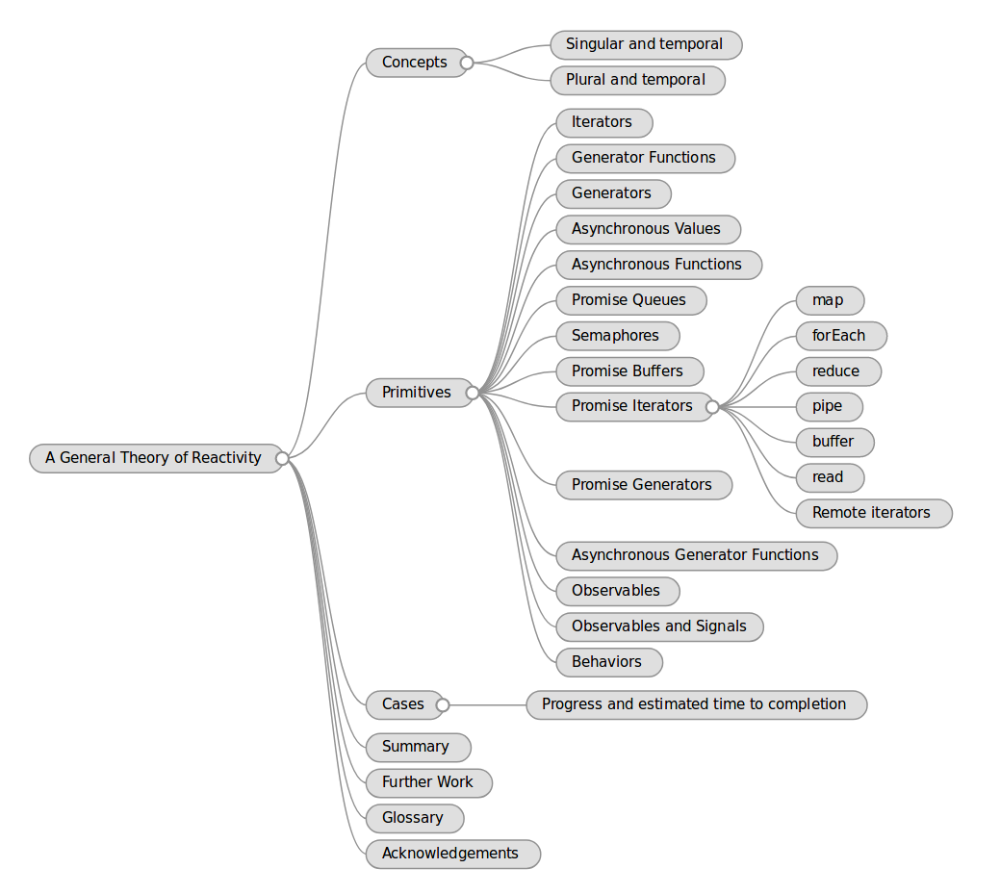

# markmap

[](https://circleci.com/gh/dundalek/markmap) [](https://www.npmjs.com/package/markmap)

*Markmap* is a javascript component that will visualize your markdown documents as mindmaps. It is useful for better navigation and overview of the content. You can see it in action online [here](http://kb.knomaton.org/multi-agent-systems/). It is also used in an [extension](https://atom.io/packages/markdown-mindmap) for Atom editor.

|  |  |
|:-:|:-:|
| Default style | Colorful style |


## Features

- Zoom in and out with the mouse wheel.
- Pan around by dragging the backgroud.
- Expand/collapse children of a node by clicking on the circle.

Supported formats:
- Markdown
- MindMup
- Txtmap (whitespace indented plaintext)
- Pandoc (limited prototype)

Suggestions for new featues are welcome, feel free to open an [issue](https://github.com/dundalek/markmap/issues).

## How to use

Install the component with NPM:
```
npm install markmap
```

Visualizing a markdown text consists of two steps:

1. The text is parsed and transformed into a tree representation.
2. The tree is rendered.

### Rendering examples

Mindmaps are rendered in the browser. To open the [example](examples/browser/example.html) you need to first start HTTP server.

If you have python installed you can for example run to start the HTTP server:
```sh
python -m SimpleHTTPServer 3000
```

Then open http://localhost:3000/examples/browser/example.html in a web browser.

### Parsing examples

Parsing different formats can be done in node.js, there are various [examples](examples/node) available. To run the markdown example:

```sh
cd examples/node
node example.parse.markdown.js
```

## Changelog

### [0.5.0](https://github.com/dundalek/markmap/compare/v0.4.2...v0.5.0) (2018-09-10)

- **Breaking change**: Changed structure of source files
- Added support for parsing inter file links for markdown
- Updated code examples

## License

The MIT License.
